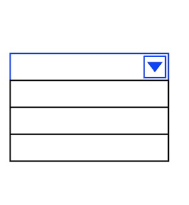

[](https://www.npmjs.com/package/@y7k/component-dropdown) [](https://www.npmjs.com/package/@y7k/component-dropdown)

# Y7K Component: Dropdown

This is a styled, custom `<select>` input Vue component. If you select an option, it will emit a event to its parent Vue component.

It is based on [Vue 2](https://vuejs.org), [MaintainableCSS](https://maintainablecss.com/) and the [Y7K Style Plate](https://github.com/y7k/style). Detailed information in the [Y7K Showroom](https://showroom.y7k.tools/showroom/pages/components/lists/filterable-list/index-filterable-list).





## Installation

##### Install npm package
```bash
npm install @y7k/component-dropdown --save
```

##### Include in your project
```js
import dropdown from '@y7k/component-dropdown';
```

##### Variant 1: Register components globally:
```js
import dropdown from '@y7k/component-dropdown';
dropdown.registerGlobally();
```
 
##### Variant 2: Use components directly:
```js
import { Dropdown } from '@y7k/component-dropdown';

// Vue component example
export default {

    components: {
        Dropdown,
    },
}
```

##### Include styles
In your main.scss file
```scss
@import '@y7k/filterable-list/src/scss/dropdown';

// If you don't set "node_modules" as a webpack include path:
@import '../[path]/../node_modules/@y7k/component-dropdown/src/scss/dropdown';
```


## Documentation
Please have a look at the usage documentation in the [Y7K Showroom](https://showroom.y7k.tools/showroom/pages/components/ui-elements/dropdown/index-dropdown).
